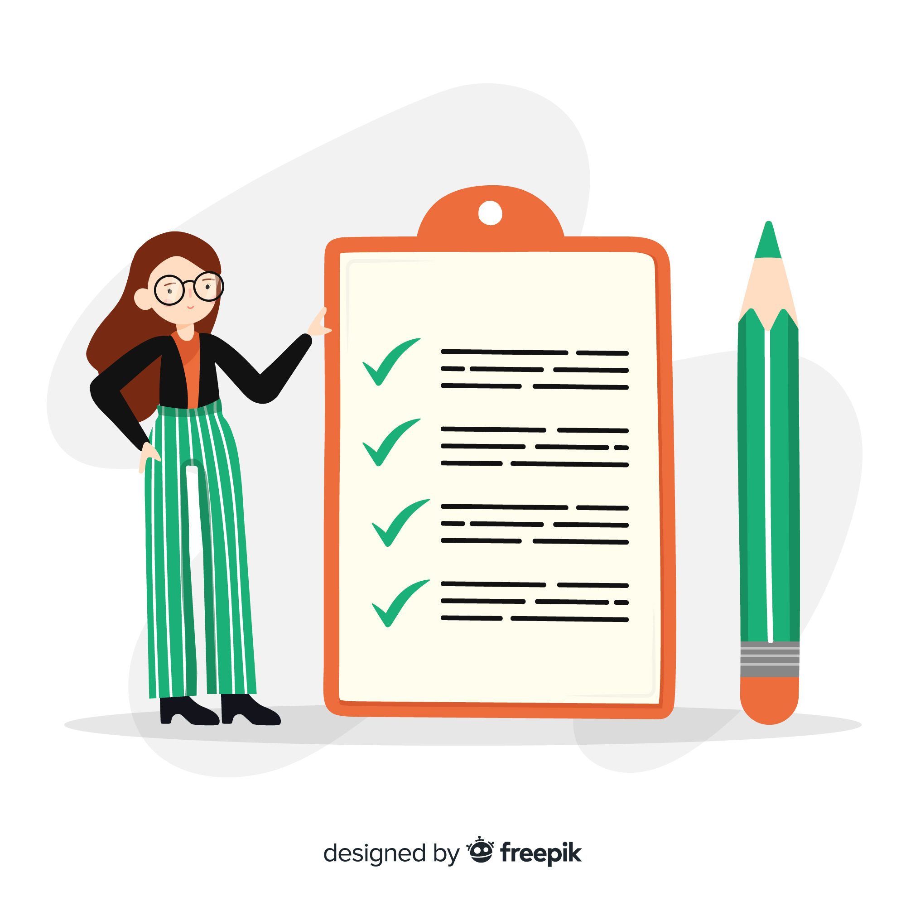

# Business card
 

## General info
Simple business card website created for "WTF: co ten frontend" coding training program - with my own design that includes lovely SVG blobs and a little trick with box-shadow CSS property. 

## Live view
Link: https://nenyancodes.github.io/WTF-business-card/ 

## Project status: _completed_

## Sources
This particular website is inspired by a homework project prepared for "WTF: co ten frontend" coding training program, which was based on specific Figma design. Here you can find [__repo__](https://github.com/nenyancodes/WTF-business-card-initial) of the original project and its [__live view__](https://nenyancodes.github.io/WTF-business-card-initial/).

## Contact
Created by Anna Wójtowicz alias __@nenyancodes__ - feel free to contact me here on [GitHub](https://github.com/nenyancodes). You can also find me on [Twitter](https://twitter.com/nenyancodes).

